# 🚀 GitHub Pages 自动部署指南

本文档说明如何使用 GitHub Actions 自动部署项目，无需手动上传 `supabase-config.js` 文件。

## 📋 方案对比

### ❌ 传统方案的问题
- `supabase-config.js` 被 `.gitignore` 忽略（安全要求）
- 部署时需要手动生成和上传配置文件
- 容易忘记或出错

### ✅ GitHub Actions 自动部署方案
- **自动化**：推送代码后自动部署
- **安全**：密钥存储在 GitHub Secrets 中
- **便捷**：无需手动操作

---

## 🔧 配置步骤

### 步骤 1：配置 GitHub Secrets

1. **打开你的 GitHub 仓库**
   
   访问：`https://github.com/你的用户名/你的仓库名`

2. **进入 Settings**
   
   点击仓库顶部的 `Settings` 标签

3. **添加 Secrets**
   
   在左侧菜单找到：
   - `Secrets and variables` → `Actions`
   - 点击 `New repository secret`

4. **添加两个密钥**

   **密钥 1：SUPABASE_URL**
   - Name: `SUPABASE_URL`
   - Secret: 你的 Supabase URL（从 `.env` 文件复制）
   - 示例：`https://uiixvbwozggzqvftkifm.supabase.co`
   
   **密钥 2：SUPABASE_ANON_KEY**
   - Name: `SUPABASE_ANON_KEY`
   - Secret: 你的 Supabase 匿名密钥（从 `.env` 文件复制）
   - 示例：`eyJhbGciOiJIUzI1NiIsInR5cCI6IkpXVCJ9...`

### 步骤 2：启用 GitHub Pages

1. **进入 Settings → Pages**

2. **配置部署源**
   - Source: `Deploy from a branch`
   - Branch: `gh-pages` / `(root)`
   - 点击 `Save`

### 步骤 3：推送代码触发部署

```bash
# 提交你的更改
git add .
git commit -m "配置 GitHub Actions 自动部署"
git push origin main
```

### 步骤 4：查看部署状态

1. 进入仓库的 `Actions` 标签
2. 查看工作流运行状态
3. 等待部署完成（通常 1-2 分钟）

### 步骤 5：访问你的网站

部署完成后，访问：
```
https://你的用户名.github.io/你的仓库名/
```

---

## 📁 已创建的文件

已为你创建以下文件：

- `.github/workflows/deploy.yml` - GitHub Actions 工作流配置

---

## 🔍 工作流程说明

### 自动化流程

```mermaid
graph LR
    A[推送代码到 GitHub] --> B[触发 GitHub Actions]
    B --> C[读取 GitHub Secrets]
    C --> D[生成 supabase-config.js]
    D --> E[部署到 GitHub Pages]
    E --> F[网站更新完成]
```



### 工作流做了什么

1. **检出代码**：获取最新的仓库代码
2. **生成配置**：使用 GitHub Secrets 动态生成 `supabase-config.js`
3. **部署文件**：将所有文件（包括生成的配置）部署到 `gh-pages` 分支
4. **发布网站**：GitHub Pages 自动发布更新

---

## ⚙️ 工作流文件说明

`.github/workflows/deploy.yml` 的关键部分：

```yaml
# 触发条件
on:
  push:
    branches:
      - main  # 推送到 main 分支时触发
  workflow_dispatch:  # 也可以手动触发

# 生成配置文件
- name: Generate Supabase Config
  env:
    SUPABASE_URL: ${{ secrets.SUPABASE_URL }}
    SUPABASE_ANON_KEY: ${{ secrets.SUPABASE_ANON_KEY }}
  run: |
    # 动态生成 supabase-config.js 文件
    cat > supabase-config.js << 'EOF'
    ...配置内容...
    EOF
```

---

## 🛠️ 手动触发部署

如果需要手动触发部署：

1. 进入仓库的 `Actions` 标签
2. 选择 `Deploy to GitHub Pages` 工作流
3. 点击 `Run workflow`
4. 选择分支并点击 `Run workflow`

---

## 📊 验证部署

### 检查清单

部署完成后，验证以下内容：

- [ ] GitHub Actions 工作流运行成功（绿色勾）
- [ ] `gh-pages` 分支已创建并包含所有文件
- [ ] 访问网站 URL 可以正常打开
- [ ] 浏览器控制台显示 "Supabase客户端初始化成功"
- [ ] 注册功能正常
- [ ] 登录功能正常

### 查看生成的配置文件

1. 切换到 `gh-pages` 分支
2. 查看 `supabase-config.js` 文件
3. 确认配置已正确注入

---

## 🔒 安全最佳实践

### ✅ 应该做的

1. **使用 GitHub Secrets**
   - 永远不要在代码中硬编码密钥
   - 所有敏感信息都存储在 Secrets 中

2. **保持 .gitignore**
   - 确保 `.env` 和 `supabase-config.js` 仍在 `.gitignore` 中
   - 这些文件不应该被提交到仓库

3. **定期轮换密钥**
   - 定期在 Supabase Dashboard 中更新密钥
   - 同时更新 GitHub Secrets 中的值

### ❌ 不应该做的

1. ❌ 不要将 `.env` 文件提交到 Git
2. ❌ 不要将 `supabase-config.js` 提交到 Git
3. ❌ 不要在代码中硬编码密钥
4. ❌ 不要分享你的 Secrets 截图

---

## 🐛 故障排查

### 问题 1：GitHub Actions 失败

**症状**：工作流显示红色 X

**解决方案**：
1. 点击失败的工作流查看日志
2. 检查 GitHub Secrets 是否正确配置
3. 确认密钥名称大小写正确：`SUPABASE_URL` 和 `SUPABASE_ANON_KEY`

### 问题 2：部署成功但网站无法访问

**症状**：404 错误或网站打不开

**解决方案**：
1. 检查 GitHub Pages 是否已启用
2. 确认 `gh-pages` 分支存在
3. 等待 5-10 分钟，GitHub Pages 可能需要时间同步

### 问题 3：Supabase 连接失败

**症状**：浏览器控制台显示 "Supabase未配置"

**解决方案**：
1. 检查 `gh-pages` 分支中的 `supabase-config.js` 内容
2. 确认 GitHub Secrets 中的值正确
3. 重新触发工作流

### 问题 4：CORS 错误

**症状**：浏览器提示跨域错误

**解决方案**：
1. 登录 Supabase Dashboard
2. 前往 Authentication → URL Configuration
3. 在 Site URL 中添加：`https://你的用户名.github.io`
4. 在 Redirect URLs 中添加：`https://你的用户名.github.io/你的仓库名/**`

---

## 🔄 更新配置

### 如果需要更新 Supabase 密钥

1. 在 Supabase Dashboard 中生成新密钥
2. 更新 GitHub Secrets：
   - Settings → Secrets → Actions
   - 点击对应密钥的 `Update` 按钮
   - 粘贴新值并保存
3. 重新触发部署（推送代码或手动触发）

---

## 📚 其他部署平台

如果不使用 GitHub Pages，也可以用类似方法部署到：

### Vercel

```bash
# 在 Vercel 项目设置中添加环境变量
SUPABASE_URL=你的URL
SUPABASE_ANON_KEY=你的密钥

# 构建命令
bash generate-config.sh
```

### Netlify

```toml
# netlify.toml
[build]
  command = "bash generate-config.sh"
  publish = "."

[build.environment]
  SUPABASE_URL = "在 Netlify 控制台中设置"
  SUPABASE_ANON_KEY = "在 Netlify 控制台中设置"
```

---

## 💡 提示

1. **首次部署**可能需要等待几分钟
2. **后续更新**通常在 1-2 分钟内完成
3. 可以在 Actions 标签中查看**部署历史**
4. 工作流会在每次推送到 `main` 分支时**自动运行**

---

## 📞 获取帮助

如果遇到问题：

1. 查看 GitHub Actions 的详细日志
2. 检查浏览器开发者工具的 Console 和 Network 标签
3. 参考 `DEPLOYMENT.md` 了解更多部署选项
4. 查看 `SUPABASE_SETUP.md` 配置数据库

---

✨ 现在你可以享受自动化部署的便利了！每次推送代码，GitHub 会自动帮你完成一切。
